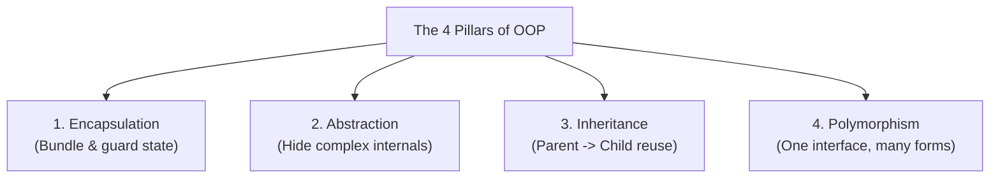
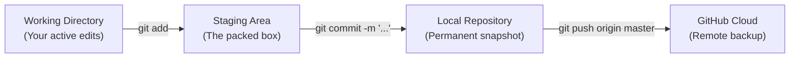

# 📖 Python & Computer Science Study Notes

Your personal, permanent engineering and study handbook. Everything we learn, code, and master is documented here.

---

## 📑 Table of Contents
1. [Core Data Structures (Collections)](#1-core-data-structures-collections)
   - [Lists](#-lists)
   - [Tuples](#-tuples)
   - [Dictionaries](#-dictionaries)
   - [Sets](#-sets)
   - [Quick Comparison Matrix](#-quick-comparison-matrix)
2. [Functions & Execution Contracts](#2-functions--execution-contracts)
   - [Parameters vs Arguments](#parameters-vs-arguments)
   - [Scope (Local vs Global)](#scope-local-vs-global)
   - [Tuple Unpacking](#tuple-unpacking)
3. [Object-Oriented Programming (OOP) Deep Dive](#3-object-oriented-programming-oop-deep-dive)
   - [The Mental Model](#the-mental-model-blueprints-vs-objects)
   - [What is `self`? (The Memory Reality)](#what-is-self-the-memory-reality)
   - [The `__init__` Constructor](#the-__init__-constructor)
   - [Instance Attributes vs Local Variables](#instance-attributes-vs-local-variables)
   - [Methods (Behaviors)](#methods-behaviors)
   - [Single Responsibility Principle (SRP)](#single-responsibility-principle-srp)
4. [The Four Pillars of OOP](#4-the-four-pillars-of-oop-🏛️)
5. [Debugging & Error Diagnosis](#5-debugging--error-diagnosis)
6. [Tabular Data & Backend Patterns](#6-tabular-data--backend-patterns-📊)
7. [Git & Version Control](#7-git--version-control-🛠️)
8. [Time & Space Complexity (Big-O)](#8-time--space-complexity-big-o-notation-⚡)

---

## 1. Core Data Structures (Collections)

### 📋 Lists
* **Syntax**: `[item1, item2, item3]`
* **Nature**: **Ordered** & **Mutable** (can be modified, added to, or deleted).
* **When to use**: When you have an ordered collection of items that changes over time (e.g. daily expenses, rows in a table).

```python
# Creation
fruits = ["Apple", "Banana", "Cherry"]

# Access by 0-based Index
print(fruits[0])  # "Apple"
print(fruits[-1]) # "Cherry" (last item)

# Modification (Mutation)
fruits[1] = "Blueberry"

# Adding & Removing
fruits.append("Date")      # Adds to the end: O(1)
fruits.pop()               # Removes the last item: O(1)
fruits.remove("Apple")     # Finds and removes "Apple": O(N)
```

---

### 🔒 Tuples
* **Syntax**: `(item1, item2, item3)`
* **Nature**: **Ordered** & **Immutable** (CANNOT be changed after creation).
* **When to use**: Data integrity protection. Returning multiple values from a function, GPS coordinates `(lat, lon)`, database connection settings.

```python
# Creation
coords = (12.9716, 77.5946)
result = (95.50, "A")

# Access (same as lists)
print(result[0])  # 95.50

# Immutability in action
# coords[0] = 13.00  <--- CRASH! TypeError: 'tuple' object does not support item assignment

# Tuple Unpacking (Clean & Pythonic)
avg, grade = result
print(avg)    # 95.50
print(grade)  # "A"
```

---

### 🔑 Dictionaries
* **Syntax**: `{key1: value1, key2: value2}`
* **Nature**: **Key-Value Mapping** & **Mutable**.
* **Lookup Speed**: **$O(1)$ Constant Time** (instant lookup using hash tables, regardless of whether you have 10 items or 10,000,000 items).
* **When to use**: Associating unique keys (e.g. `student_id`, `username`, `subject_name`) with records or attributes.

```python
# Creation
student = {
    "name": "Alice",
    "marks": {"Math": 95, "Science": 90}
}

# Reading
print(student["name"])          # "Alice"
print(student.get("age", 18))   # Safe lookup with default fallback: 18

# Updating / Inserting
student["grade"] = "A"          # Adds key "grade"
student["name"] = "Alice J."    # Overwrites existing key "name"

# Common Dictionary Iterations
for key in student.keys():                  # Iterate keys
    print(key)

for value in student.values():              # Iterate values
    print(value)

for key, value in student.items():          # Iterate key-value pairs together
    print(key, "->", value)
```

---

### ⚡ Sets
* **Syntax**: `{item1, item2, item3}`
* **Nature**: **Unordered**, **Unique items only** (no duplicates allowed).
* **When to use**: Deduplicating data and instant membership tests (`if x in my_set`).

```python
raw_tags = ["python", "ai", "python", "backend"]
unique_tags = set(raw_tags)  # {'python', 'ai', 'backend'}

# Instant O(1) membership check
if "ai" in unique_tags:
    print("Found!")
```

---

### 📊 Quick Comparison Matrix

| Collection | Syntax | Ordered? | Mutable? | Allows Duplicates? | Lookup Speed |
| :--- | :--- | :--- | :--- | :--- | :--- |
| **List** | `[...]` | ✅ Yes | ✅ Yes | ✅ Yes | By Index: $O(1)$, By Value: $O(N)$ |
| **Tuple** | `(...)` | ✅ Yes | ❌ No | ✅ Yes | By Index: $O(1)$, By Value: $O(N)$ |
| **Dictionary**| `{k: v}`| ✅ Yes (3.7+) | ✅ Yes | ❌ Keys unique | By Key: **$O(1)$** |
| **Set** | `{...}` | ❌ No | ✅ Yes | ❌ No | By Value: **$O(1)$** |

---

## 2. Functions & Execution Contracts

### Parameters vs Arguments
* **Parameters**: The placeholder variables defined in the function signature.
* **Arguments**: The actual data values passed into the function when called.

```python
# 'name' and 'score' are PARAMETERS
def announce(name: str, score: float):
    print(f"{name} scored {score}")

user_name = "DK"
final_mark = 98.0

# 'user_name' and 'final_mark' are ARGUMENTS
announce(user_name, final_mark)
```

### Scope (Local vs Global)
* Variables defined inside a function exist **only** while the function runs (local scope).
* When the function finishes, local variables are destroyed.
* Functions should avoid relying on global variables; pass data in through parameters and receive data out via `return`.

---

## 3. Object-Oriented Programming (OOP) Deep Dive

### The Mental Model: Blueprints vs Objects
```mermaid
classDiagram
    class Student {
        +String student_id
        +String name
        +dict marks
        +calculate_results() tuple
        +display_report_card() void
    }
    class Object_Alice {
        student_id = "S101"
        name = "Alice"
        marks = {"Math": 95}
    }
    class Object_Bob {
        student_id = "S102"
        name = "Bob"
        marks = {"Math": 65}
    }
    Student <|-- Object_Alice : Instance of
    Student <|-- Object_Bob : Instance of
```

* **Class (`Student`)**: The blueprint/cookie cutter. Takes zero memory for individual student data.
* **Object / Instance (`s1`, `s2`)**: The actual stamped cookie in memory holding its own specific data.

---

### What is `self`? (The Memory Reality)
`self` is **NOT** a storage container or temporary cache. 
**`self` IS the object itself in computer memory!**

```python
class Student:
    def __init__(self, name):
        self.name = name
        print("Address of self:", id(self))

s1 = Student("Alice")
print("Address of s1  :", id(s1))
# Output:
# Address of self: 1402384920
# Address of s1  : 1402384920  <--- EXACT SAME MEMORY ADDRESS!
```

* Outside the class: You call it `s1` (`s1.name`).
* Inside class methods: The object refers to itself as `self` (`self.name`).

---

### The `__init__` Constructor
* Special Python method (`dunder init`).
* Runs automatically the exact millisecond `Student(...)` is created.
* Purpose: Sets up initial attributes on `self`.

```python
class Student:
    def __init__(self, student_id: str, name: str, marks: dict):
        # Attach variables to the instance permanently:
        self.student_id = student_id
        self.name = name
        self.marks = marks
```

---

### Methods (Behaviors)
A method is simply a function that lives inside a class and automatically receives `self` as its first parameter.

```python
    def display_report_card(self):
        # Has direct access to self.student_id, self.name, self.marks
        print(f"ID: {self.student_id}")
        print(f"Name: {self.name}")
```

When you call:
`s1.display_report_card()`
Python translates it under the hood to:
`Student.display_report_card(s1)`

---

### Single Responsibility Principle (SRP)
Each class should have one job, and one job only.
* **`Student` class**: Responsible for **one student's** state and performance calculation.
* **`GradeBook` or CLI Script**: Responsible for collecting inputs and managing **all students**.

---

## 4. The Four Pillars of OOP 🏛️



### 1. Encapsulation (Protecting Data)
* Bundles data attributes and methods together.
* Restricts direct outside access so data cannot be set to illegal states (e.g. negative balances).
* Example:
  ```python
  class BankAccount:
      def __init__(self):
          self._balance = 0.0

      def deposit(self, amount):
          if amount <= 0:
              raise ValueError("Must be positive")
          self._balance += amount
  ```

### 2. Abstraction (Hiding Complexity)
* Hides internal calculations, loops, and formulas behind clean, simple methods.
* The caller only needs to know **what** a method does, not **how** it works under the hood.
* Example:
  ```python
  student.display_report_card()  # Simple to call, hides 20 lines of math/formatting
  ```

### 3. Inheritance (Code Reuse: "IS-A")
* A child class inherits all attributes and methods from a parent class, and adds its own unique features.
* Example:
  ```python
  class User:
      def __init__(self, username):
          self.username = username

  class Admin(User):  # Admin IS-A User!
      def ban(self, user):
          print(f"{self.username} banned {user}")
  ```

### 4. Polymorphism ("Many Forms")
* Different classes implement the same method name, but each behaves differently.
* Example:
  ```python
  class Dog:
      def speak(self): return "Woof!"

  class Cat:
      def speak(self): return "Meow!"

  for animal in [Dog(), Cat()]:
      print(animal.speak())
  ```

---

## 5. Debugging & Error Diagnosis
* **`TypeError`**: Wrong datatype or invalid operation for that type:
  * *Example A*: Comparing `'str' > 'float'`.
  * *Example B (String indexing)*: `"category"["amount"]` ➔ `TypeError: string indices must be integers, not 'str'` (happens when looping over a dictionary and treating its key string as a dictionary).
  * *Example C (Unhashable type)*: `amount[amount]` where `amount` is a dictionary ➔ `TypeError: unhashable type: 'dict'` (dictionaries are mutable and cannot be used as dictionary keys).
* **`ValueError`**: Correct datatype, but invalid domain value (e.g. negative marks, negative expense amount).
* **`AttributeError`**: Trying to call a method that doesn't exist on that type (e.g. calling `dict.append()` instead of `list.append()`, or calling `.lower()` on a `list`).
* **`KeyError`**: Trying to access a dictionary key that doesn't exist:
  * *Literal string key vs Variable*: `expense["category"]` accesses key `"category"`. But `expense[category]` evaluates variable `category` (which might be `"food"`) and crashes with `KeyError: 'food'`.
* **`IndexError`**: Trying to access a list index that is out of range (e.g. `list[1]` when list has only 1 item).

---

## 6. Tabular Data & Backend Patterns 📊

### Lists of Lists vs Lists of Dictionaries
In backend engineering, spreadsheets, APIs, and databases all represent rows of data in memory:

#### Option A: List of Lists
* **Format**: `[["Food", 150.0, "Lunch"], ["Transport", 50.0, "Bus"]]`
* **Access**: By position index (`row[0]` for category, `row[1]` for amount).
* **Use case**: Quick internal processing, CSV row parsing.

#### Option B: List of Dictionaries (The API / Database Standard)
* **Format**:
  ```python
  expenses = [
      {"category": "Food", "amount": 150.0, "description": "Lunch"},
      {"category": "Transport", "amount": 50.0, "description": "Bus"}
  ]
  ```
* **Access**: By key name (`item["amount"]`, `item["category"]`).
* **Why it matters**: Web APIs (FastAPI) serialize this directly to **JSON**. Frontend clients (React/iOS) require key names to display data safely.

---

### The 3 Core Data Algorithms

#### 1. Aggregation (Total Sum)
```python
total = 0.0
for item in self.expenses:
    total += item["amount"]
```

#### 2. Finding Extremum (Highest / Maximum Row)
```python
if not self.expenses:
    return None

highest = self.expenses[0]  # Start with the first actual row
for item in self.expenses:
    if item["amount"] > highest["amount"]:
        highest = item
return highest
```

#### 3. Filtering (List Comprehension)
```python
# Normalizes casing so "food", "Food", and "FOOD" all match:
filtered = [
    item for item in self.expenses 
    if item["category"].lower() == category.lower()
]
```

---

## 7. Git & Version Control 🛠️

### The 3 Stages of Git


### Essential Commands Cheat Sheet
| Command | Purpose |
| :--- | :--- |
| `git init` | Initializes a brand-new local Git repository (`.git` folder). |
| `git status` | Shows state of working directory (untracked, modified, staged files). |
| `git diff` | Shows exact line-by-line additions and deletions before staging. |
| `git add <file>` / `git add .` | Moves file(s) into the Staging Area preparing for snapshot. |
| `git restore --staged <file>` | Unstages a file from the staging area without losing edits. |
| `git restore <file>` | Discards local changes in working directory, reverting to last commit. |
| `git commit -m "message"` | Saves a permanent snapshot with author, timestamp, and message. |
| `git log --oneline` | Displays past commit history with 7-character hash fingerprints. |
| `git remote add origin <url>` | Links local repository to a remote GitHub repository. |
| `git push -u origin master` | Uploads local commits to GitHub. |

### The `.gitignore` File
* Tells Git which files and folders to **never track or commit**.
* **Essential ignores for Python & Backend**:
  * `__pycache__/` & `*.pyc` (compiled bytecode)
  * `.venv/` (virtual environments — can be gigabytes of packages)
  * `.env` (private environment variables, secrets, database passwords, API keys)

### Git vs GitHub
* **Git**: The local command-line version control engine on your computer (100% offline).
* **GitHub**: The cloud web platform where teams store, review, and collaborate on Git repositories.

---

## 8. Time & Space Complexity (Big-O Notation) ⚡

### Why Big-O?
We do not measure an algorithm's efficiency in seconds because hardware speeds differ (laptop vs. cloud server). Instead, we measure **growth rate**:
> How does the number of operations (Time) and memory allocated (Space) scale as the input size (N) grows?

### The Big-O Growth Curves (ASCII Visualization)
```text
Operations / Time
  ^
  |                                        O(N^2) [Quadratic - Nested Loops]
  |                                      /
  |                                     / 
  |                                    /    O(N) [Linear - Single Loop]
  |                                   /   /
  |                                  /  /
  |                                 / /
  |                                //
  |                              //
  |                             //
  |---------------------------------------> O(1) [Constant - Instant Hash Lookup]
  +----------------------------------------> Input Size (N)
    10 items         10,000 items        10,000,000 items
```

### The Core Complexity Tiers
| Complexity | Name | Operations for N = 10,000 | Code Example |
| :--- | :--- | :--- | :--- |
| **`O(1)`** | Constant | 1 instant step | Dictionary key lookup (`dict["key"]`), list index access (`list[0]`) |
| **`O(N)`** | Linear | 10,000 steps | Single `for` loop over a list (e.g. `get_total()`, `get_highest()`) |
| **`O(N^2)`** | Quadratic | 100,000,000 steps! | Nested loop comparing every item to every other item |

### Space Complexity (Memory Consumption)
* **`O(1)` Extra Space**: Uses fixed memory regardless of input size (e.g., `total = 0.0` or a single pointer variable).
* **`O(N)` Extra Space**: Creates a new data structure in memory that holds up to N items (e.g., `seen = set()`, list comprehension `[x for x in list]`).

### The Fundamental Trade-off: Time vs. Space
```text
========================================================================
Approach                  Time Complexity       Space Complexity (RAM)
========================================================================
Nested Loops              O(N^2)  [SLOW]        O(1)  [Zero extra RAM]
Hash Set Lookups          O(N)    [FAST]        O(N)  [Uses a little RAM]
========================================================================
```
In modern software engineering, backend APIs, and AI models, we often use `O(N)` space (like hash sets or dictionaries) to avoid `O(N^2)` slow loops.
