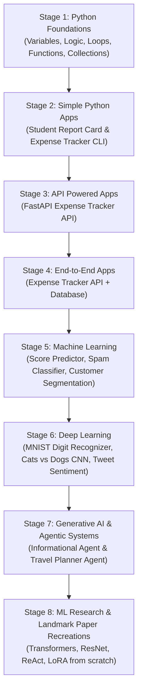

# 🗺️ Master Learning Roadmap: From Fundamentals to AI Agents & ML Research

A project-driven curriculum designed to build deep, first-principles understanding through active coding, debugging, system design, and recreating landmark AI/ML research papers.

---

## 🧭 Milestone & Stage Progression

---

## 📌 Stage 1: Python Foundations

### Core Concepts
- [x] Variables & Datatypes
- [x] Conditional Statements (`if` / `elif` / `else`)
- [x] Looping Constructs (`for`, `while`, loop control)
- [x] Functions (`def`, arguments, return values, scope)
- [x] Data Structures (Collections):
  - [x] Lists (indexing, slicing, methods)
  - [x] Tuples (immutability, packing/unpacking)
  - [x] Dictionaries (key-value pairs, nested dicts, methods)

---

## 📌 Stage 2: Build Simple Python Apps

### 🛠️ Project 1: Student Report Card Generator
- [x] Input Student ID, Name & Marks for each subject
- [x] Store student data & marks using dictionaries
- [x] Calculate Average & Grade for each student
- [x] Print a formatted Report Card for each student
- [x] OOP Refactoring & Class Representation (Blueprints, `__init__`, `self`, methods)

### 🛠️ Project 2: Personal Expense Tracker (CLI)
- [x] Add daily expenses (Category + Amount)
- [x] Store expenses in a list of dictionaries
- [x] Implement functions to calculate Total Spent, Highest Expense, etc.
- [x] Filter and view expenses by category

### 🔄 Build / Run / Debug / Fix Engineering Workflow
- [x] Build: Writing modular, clean code
- [x] Run: Executing in terminal & handling inputs
- [x] Debug: Identifying tracebacks, errors, and logic flaws
- [x] Fix: Formulating root-cause fixes independently

---

## 📌 Stage 3: Build Your First API Powered App

### 🛠️ Project 3: Personal Expense Tracker — API Version
- [ ] Setup Python with FastAPI app in VS Code / IDE
- [ ] Implement `POST /expenses` (Add Expense API) & test with Postman / Swagger
- [ ] Implement `GET /expenses` (Get All Expenses API) & test
- [ ] Implement `GET /expenses/highest` (Get Highest Expense API) & test
- [ ] Request validation with Pydantic & HTTP status code handling

---

## 📌 Stage 4: Build Your First End-to-End App

### 🛠️ Project 4: Personal Expense Tracker — API + DB Version
- [ ] Setup database configurations & connection in the application
- [ ] Modify `POST /expenses` to store details in the database
- [ ] Modify `GET /expenses` to fetch data from the database
- [ ] Modify `GET /expenses/highest` to query data from the database
- [ ] Schema migrations & ORM / SQL query management

---

## 📌 Stage 5: Machine Learning

### 🛠️ Project 5: Student Score Predictor (Regression)
- [ ] Data Cleansing & Exploration
- [ ] Split Training & Testing data (`train_test_split`)
- [ ] Cost Function & Mean Squared Error (MSE)
- [ ] Model Training with Scikit-Learn
- [ ] Evaluation report (Predicted vs Actual, Error Metrics)

### 🛠️ Project 6: Spam Email Classifier (Classification)
- [ ] Text Preprocessing (cleaning, tokenization, stopword removal)
- [ ] Text Vectorization (Bag of Words, TF-IDF)
- [ ] Model Training (Naive Bayes / Logistic Regression / Tree models)
- [ ] Performance Evaluation (Accuracy, Precision, Recall, Confusion Matrix)

### 🛠️ Project 7: Customer Segmentation (Clustering)
- [ ] Data Preparation (Age, Income, Spending Score)
- [ ] K-Means Clustering Algorithm mechanics
- [ ] Finding optimal clusters using the Elbow Method
- [ ] Data Visualization with Matplotlib & Seaborn
- [ ] Summarizing & profiling each customer cluster

---

## 📌 Stage 6: Deep Learning

### 🛠️ Project 8: Handwritten Digit Recognizer (MNIST)
- [ ] Neural Network Layers & Architecture (Input, Hidden, Output)
- [ ] Activation Functions (ReLU, Softmax, Sigmoid)
- [ ] Loss Functions (Cross-Entropy Loss) & Optimization
- [ ] Training & Test Data evaluation (MNIST dataset)
- [ ] Model Evaluation aiming for 90%+ test accuracy

### 🛠️ Project 9: Cats vs Dogs Classifier (CNN)
- [ ] Convolutional Neural Network (Convolutions, Pooling, Feature Maps)
- [ ] Preventing Overfitting (Dropout, Regularization)
- [ ] Data Augmentation techniques
- [ ] Testing on unseen images & model evaluation

### 🛠️ Project 10: Sentiment Analysis on Tweets (NLP & Sequence Models)
- [ ] Tweet text cleaning & preprocessing
- [ ] Word Embeddings (numerical vector representations)
- [ ] Recurrent Neural Networks (RNN / LSTM) for sequential context
- [ ] Model Training & Evaluation on tweet sentiment classification

---

## 📌 Stage 7: Generative AI & Agentic Systems

### 🛠️ Project 11: Informational Agent (Weather & News APIs)
- [ ] LLM Tool Calling & Function Calling mechanics
- [ ] Intent Recognition: Deciding which API to call based on user query
- [ ] API Request Execution, Response Parsing & User Formatting
- [ ] Multi-tool routing (Weather API, News API, Dictionary API)
- [ ] Error handling & graceful fallback mechanisms

### 🛠️ Project 12: Autonomous Travel Planner Agent
- [ ] Multi-step Task Decomposition (Transport, Accommodation, Food, Sightseeing)
- [ ] Connecting to external APIs (Flights, Hotels, Maps)
- [ ] Budget Constraint Enforcement (e.g., "Under ₹10,000 for 3 days")
- [ ] Structured Daily Itinerary generation & interactive follow-up

---

## 📌 Stage 8: ML Research & Landmark Paper Recreations

### 🔬 Paper Recreations from Scratch
- [ ] **Paper 1**: *"Deep Residual Learning for Image Recognition"* (He et al., 2015 - ResNet)
  - Recreating residual skip connections and bottleneck blocks from scratch in PyTorch
- [ ] **Paper 2**: *"Attention Is All You Need"* (Vaswani et al., 2017 - Transformer)
  - Recreating Scaled Dot-Product Attention, Multi-Head Attention, and Positional Encodings from scratch
- [ ] **Paper 3**: *"Retrieval-Augmented Generation for Knowledge-Intensive NLP Tasks"* (Lewis et al., 2020 - RAG)
  - Recreating dense passage retrieval, custom embedding vector indexing, and generator integration
- [ ] **Paper 4**: *"LoRA: Low-Rank Adaptation of Large Language Models"* (Hu et al., 2021 - LoRA)
  - Recreating low-rank matrix decomposition ($W + B \times A$) for parameter-efficient fine-tuning
- [ ] **Paper 5**: *"ReAct: Synergizing Reasoning and Acting in Language Models"* (Yao et al., 2022 - ReAct)
  - Recreating the thought-action-observation reasoning loop from scratch
